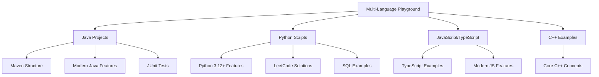
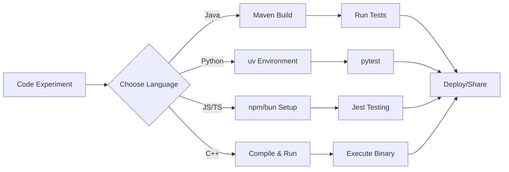
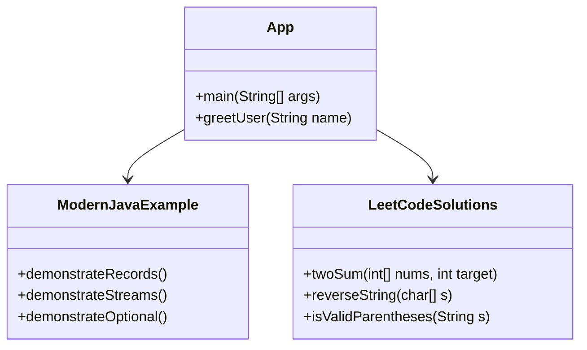
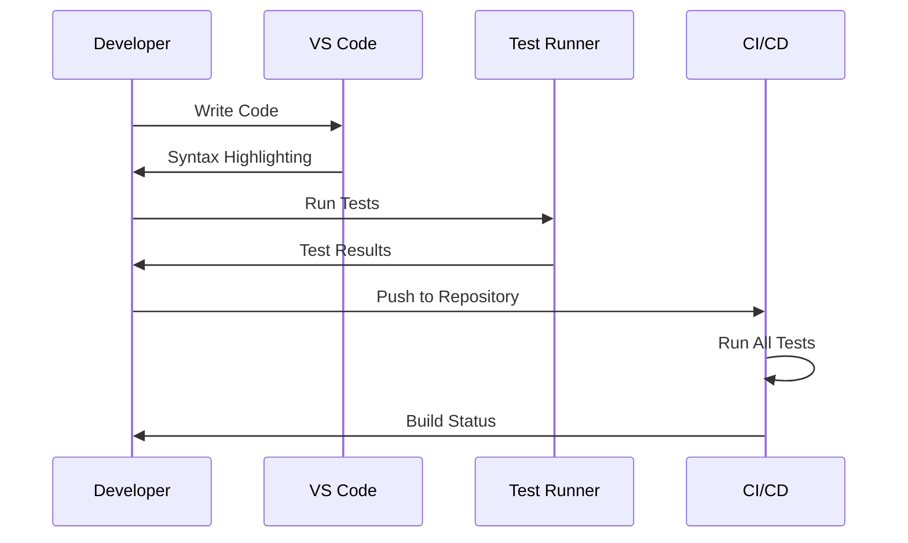
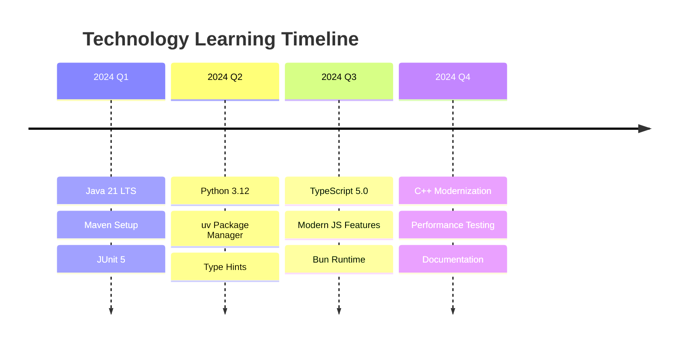
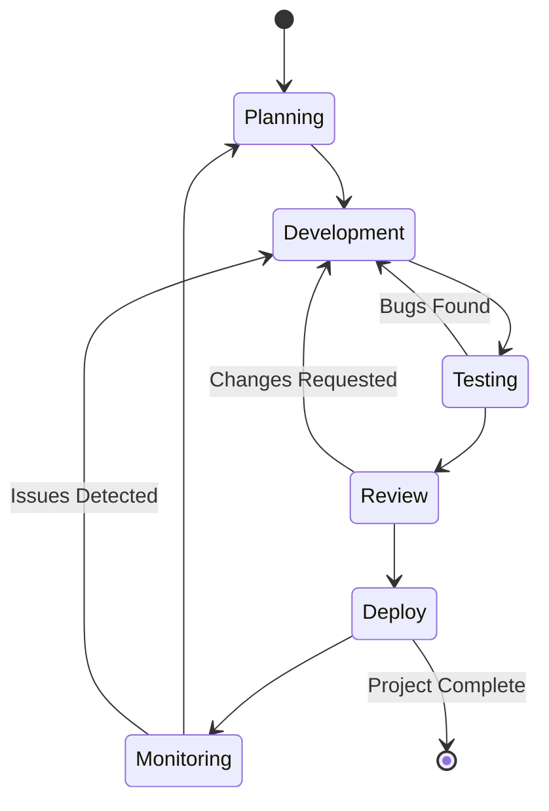
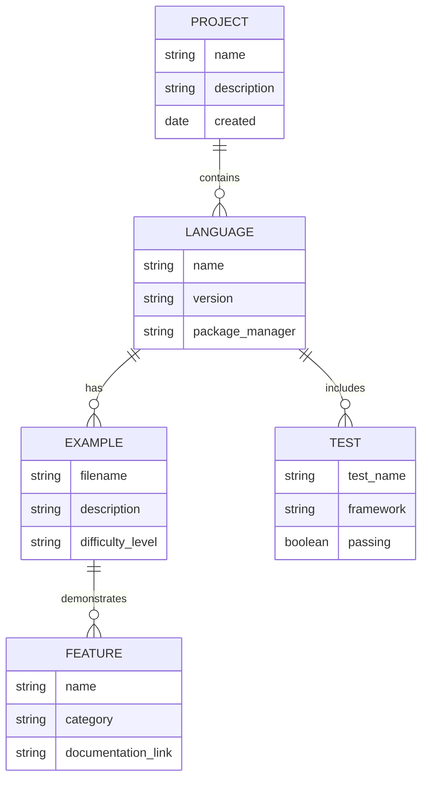
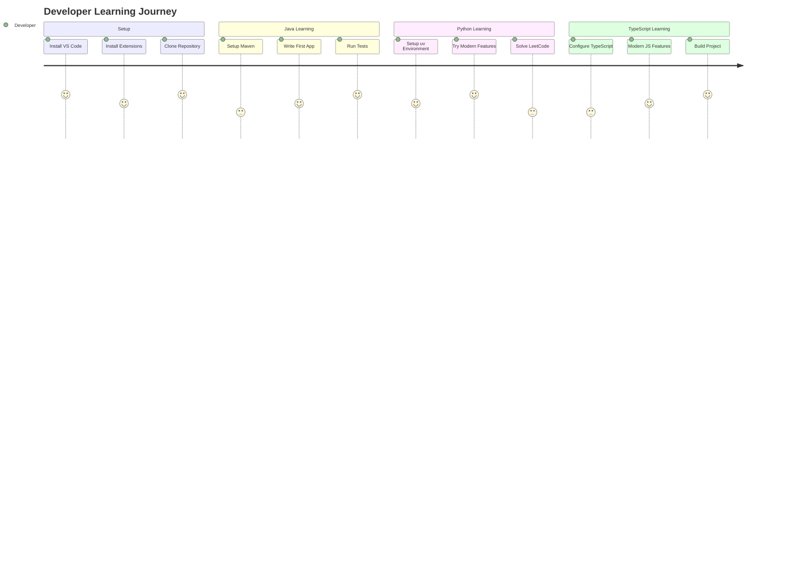

# Playground for Testing and Learning Code

This is a multi-language playground repository for experimenting with different technologies,
frameworks, and language features.

## Mermaid Diagrams for VS Code Extension Testing

The following Mermaid diagrams are included to test VS Code GUI extensions and visualization
capabilities.

### Project Architecture Overview



### Development Workflow



### Class Diagram Example



### Sequence Diagram - Testing Process



### Git Workflow

```mermaid
gitgraph
    commit id: "Initial setup"
    branch feature/java-examples
    checkout feature/java-examples
    commit id: "Add Maven structure"
    commit id: "Modern Java features"
    checkout main
    merge feature/java-examples
    branch feature/python-examples
    checkout feature/python-examples
    commit id: "Python 3.12 features"
    commit id: "LeetCode solutions"
    checkout main
    merge feature/python-examples
    commit id: "Update documentation"
```

### Technology Stack Timeline



### State Diagram - Development Lifecycle



### Entity Relationship Diagram



### User Journey Map



## Project Structure

````markdown name=structure.md
```
playground/
├── src/main/java/          # Java source code
├── python/                 # Python experiments
├── ts/                     # TypeScript examples
├── cpp/                    # C++ code
├── docs/                   # Documentation
└── target/                 # Build artifacts
```
````
